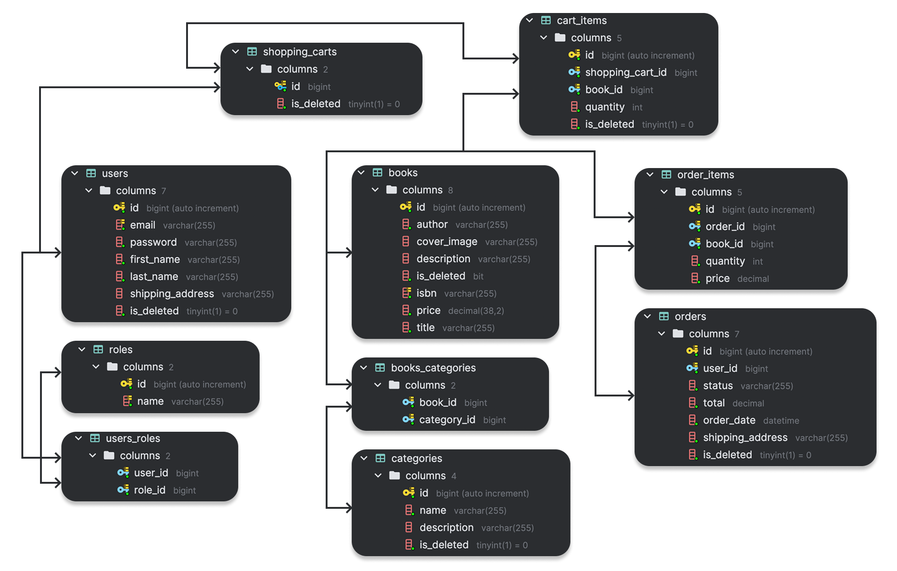

<h1 align="center" style="display: block; font-size: 1em; font-weight: bold; margin-block-start: 0.5em; margin-block-end: 1em;">
<picture>

</picture>
<br /><br /><strong>📚 Online Book Store 📚</strong>
</h1>

# 🧭 Navigation list

---

<div>

- [Introduction](#-introduction)
    - [What inspired me to create this project?](#what-inspired-me-to-create-this-project)
    - [What problems does my project resolve?](#what-problems-does-my-project-resolve)
- [Technologies and Tools](#-technologies-and-tools)
    - [Technologies](#technologies)
    - [Tools](#tools)
- [Functionality of controllers](#-unique-functionality-of-controllers)
    - [Authentication management](#-authentication-controller)
    - [Book management](#-book-controller)
    - [Categories management](#-category-controller)
    - [Order management](#-order-controller)
    - [ShoppingCart management](#-shoppingcart-controller)
- [Database structure](#-database-structure-entity-relationships)
- [Set up and starting project](#-set-up-and-starting-project)
- [API Documentation](#-api-documentation)
- [Postman collection](#-postman-collection)
- [Challenges & Solutions](#-challenges--solutions)
- [Contacts](#-contacts)

</div>

<div>

# 📝 Introduction

---

### **What inspired me to create this project?**

The primary inspiration for this project was my desire to build a robust backend system that interacts seamlessly with APIs. I envisioned creating a fully functional online bookstore, a platform that would provide users with an easy-to-navigate interface for browsing, purchasing, and managing books. This project allows me to delve deeper into backend development, improving my skills in API integration, data management, and scalability. By working on this, I aim to create a service that could be expanded upon in the future and potentially serve as a foundation for other API-driven applications.


### **What problems does my project resolve?**

This web application addresses several key issues related to the selection and purchase of books online. It provides a seamless platform where users can easily browse through various book categories, search for specific titles, and make purchases in a user-friendly and efficient manner. The application simplifies the shopping experience by organizing books into relevant categories, allowing users to quickly find what they are looking for.

Moreover, it resolves common challenges such as the difficulty of managing large inventories, offering a well-structured interface that supports both users and administrators in handling data efficiently. This project also paves the way for scalability, allowing for future expansion to include features such as personalized recommendations, user reviews, and enhanced filtering options.

</div>

# 🛠 Technologies and tools
<div>

---

### Technologies:
- **JAVA 17**
- **Spring Framework** (v3.4.1):
  - Spring Boot
  - Spring Data JPA
  - Spring Boot Security
  - Spring Boot Validation
- **Database:**
  - MySQL (v8.0.33)
  - Liquibase (Database migration tool): v4.24.0
- **Lombok**
- **MapStruct**
- **JSON Web Tokens**
- **Tomcat**
- **Hibernate**
- **SpringDoc OpenAPI & Swagger UI**

### Tools:

- **IntelliJ IDEA 2025.1 (UE)**
- **Maven**
- **JUnit 5**
- **Docker**
- **Testcontainers**
- **Postman**
- **GitHub**
- **AWS**

</div>

<div>

# 🎯🚀 Unique functionality of controllers

---

### 👤 Authentication controller
The Auth Controller handles registration and authentication processes for users.

| HTTP Request | Endpoint             | Description                                                                          |
|--------------|----------------------|--------------------------------------------------------------------------------------|
| POST         | `/auth/registration` | Allows new users to sign up by providing their email, password, and personal details |
| POST         | `/auth/login`        | Authenticates a user and provides a JWT for accessing protected endpoints            |


### 📖 Book controller
The Book Controller manages the creation, retrieval, search, update, and deletion of books with role-based access control.

| HTTP Request | Endpoint        | Description                                                                                                      |
|--------------|-----------------|------------------------------------------------------------------------------------------------------------------|
| GET          | `/books`        | Retrieves a paginated list of all books                                                                          |
| GET          | `/books/{id}`   | Retrieves detailed information for a specific book by its ID                                                     |
| GET          | `/books/search` | Searches for books based on specific parameters (e.g., category, author) and returns a paginated list of results |
| POST         | `/books`        | Creates a new book in the database                                                                               |
| PUT          | `/books/{id}`   | Updates an existing book's details                                                                               |
| DELETE       | `/books/{id}`   | Deletes a specific book by its ID                                                                                |

### 📂 Category controller
Category Controller provides endpoints for managing book categories, including CRUD operations and listing books associated with specific categories. Access is role-based to ensure security.

| HTTP Request | Endpoint                 | Description                                                              |
|--------------|--------------------------|--------------------------------------------------------------------------|
| GET          | `/categories`            | Retrieve a paginated list of all categories                              |
| GET          | `/categories/{id}`       | Retrieve details of a specific category by its ID                        |
| GET          | `/categories/{id}/books` | Retrieves a paginated list of all books belonging to a specific category |
| POST         | `/categories`            | Create a new category and save to database                               |
| PUT          | `/categories/{id}`       | Update an existing category by its ID                                    |
| DELETE       | `/categories/{id}`       | Delete a category by its ID                                              |

### 📦 Order controller
The Order Controller manages the creation, retrieval, and updating of orders and their items. It supports both user-specific operations and administrative tasks for managing orders.

| HTTP Request | Endpoint                           | Description                                                                    |
|--------------|------------------------------------|--------------------------------------------------------------------------------|
| GET          | `/orders`                          | Retrieve a paginated list of all orders placed by the currently logged-in user |
| GET          | `/orders/{orderId}/items`          | Retrieve a detailed list of order items for a specific order by its ID         |
| GET          | `/orders/{orderId}/items/{itemId}` | Fetch details of a specific item from an order                                 |
| POST         | `/orders`                          | Places an order and save to database                                           |
| PATCH        | `/orders/{id}`                     | Update the status of an order (e.g., to "shipped" or "delivered")              |

### 🛒 ShoppingCart controller
The Shopping Cart Controller manages the retrieval, modification, and deletion of items in a user's shopping cart. It ensures that only authenticated users can interact with their shopping cart.

|  HTTP Request | Endpoint           | Description                                                                   |
|---------------|--------------------|-------------------------------------------------------------------------------|
| GET           | `/cart`            | Retrieve the shopping cart of the currently authenticated user                |
| POST          | `/cart`            | Add a book to the shopping cart                                               |
| PUT           | `/cart-items/{id}` | Update the details (e.g., quantity) of an existing item in the cart by its ID |
| DELETE        | `/cart-items/{id}` | Delete an item from the shopping cart by its ID                               |

</div>

<div>

# 🗂️ Database structure (entity relationships)

---

  

#### *Role: USER*

- Can register an account.
- Can search for books based on various criteria (e.g., title, author, ISBN).
- Can add books to the shopping cart.
- Can edit their shopping cart (e.g., delete books).
- Can update the quantity of books in the shopping cart.

#### *Role: ADMIN*
- Has the ability to add, update, and delete books in the system.
- Can manage book categories, including adding, deleting, and modifying them.
- Has the authority to set and modify book prices.

</div>

<div>

# ⚙️ Set up and starting project

---

## Steps
1. Prerequisites [Docker](https://www.docker.com/get-started) and [Docker Compose](https://docs.docker.com/compose/install/) on your machine.
2. Clone the Repository
   ```sh
    git clone https://github.com/ihor-sydorenko/online-book-store.git
    ```
3. Navigate to the project directory
    ```sh
     cd online-book-store
    ```
4. Configure Environment variables:

- Create a `.env` file in the project directory to store your database credentials. This file should contain the necessary environment variables, such as `DB_DATABASE`, `DB_USER`, and `DB_PASSWORD`.

  ```sh
  MYSQLDB_USER=<your_database_username>
  MYSQLDB_ROOT_PASSWORD=<your_database_password>
  MYSQLDB_DATABASE=online_book_store
  MYSQLDB_LOCAL_PORT=3307
  MYSQLDB_DOCKER_PORT=3306

  SPRING_LOCAL_PORT=8088
  SPRING_DOCKER_PORT=8080
  DEBUG_PORT=5005

  JWT_EXPIRATION=3000000
  JWT_SECRET=<your_jwt_secret>
  ```
- Replace the placeholders <your_database_username>, <your_database_password>, and <your_jwt_secret> with actual values.
- Update the `application.properties` file located in the `src/main/resources` directory with your specific database connection details and any other necessary configurations.

5. Build and Start the application:
- Use the following command to start the application and all required services via Docker Compose:
   ```sh
  docker compose up --build 
   ```
- Wait for the services to start. You should see logs indicating that the application and database are running.

6. Access the Application:

- If you are accessing the application locally (outside the container), use the port defined in `SPRING_LOCAL_PORT`. Since the `context-path` is set to `/api`, the application will be accessible at:
http://localhost:8080/api
 

- If you are working inside a container, the application will be accessible on the port defined in `SPRING_DOCKER_PORT`. Use the following address:
  http://localhost:8088/api

### Additional Notes:
- `SPRING_LOCAL_PORT`, `SPRING_DOCKER_PORT`, and `DEBUG_PORT` define the ports for the application and debugging and should match your local and containerized setup.
- The separation of ports (`SPRING_LOCAL_PORT` and `SPRING_DOCKER_PORT`) allows you to work locally on one port and expose another port for Docker containers.
- Ensure you are accessing the correct port depending on your working environment.
</div>

<div>

# 🖇️ API Documentation

---

To explore and test the API endpoints, you can use Swagger. Swagger provides interactive API documentation that allows you to test endpoints directly from the browser.

### - **[Swagger Documentation](http://localhost:8088/api/swagger-ui/index.html)**

<div>

# 📬 Postman collection

---
You can find a Postman collection in docs/online-book-store-app-api.postman_collection.json. To use this:
[online-book-store.postman_collection.json](docs/online-book-store.postman_collection.json)

1. Import the file into Postman.
2. Adjust Authorization headers (use JWT obtained from login endpoint).
3. Test all exposed APIs such as authentication, book management, and more.


- #### Short instruction how to use postman collection:
https://www.loom.com/share/ded1b43416954db29866094f24e5e591?sid=dcbc3e52-5924-4c83-94f2-020cf3a365b0
</div>

# 💪 Challenges & Solutions

---

1. **Managing Schema Changes**

- Problem: Updating the database schema consistently during development.
- Solution: Adopted Liquibase for schema versioning and included Liquibase scripts in docker-compose.

2. **Creating the `.jar` file and Docker Integration**
- Problem: Correctly generating the `.jar` file for the project. This issue was compounded by problems with Docker integration.
- Solution: Update the IntelliJ IDEA settings to specify the correct path to the main class, as well as fixing issues in the `pom.xml` file. These adjustments ensured that the `.jar` file was correctly built and integrated with Docker without further issues.

By addressing these challenges with the appropriate solutions, I was able to successfully overcome the obstacles and move forward with the project.
</div>

<div>

# 📧 Contacts

---

Feel free to reach out for feedback or questions:

- GitHub: [Ihor Sydorenko](https://github.com/ihor-sydorenko)
- Email: sidorenko.igorek@gmail.com

</div>
